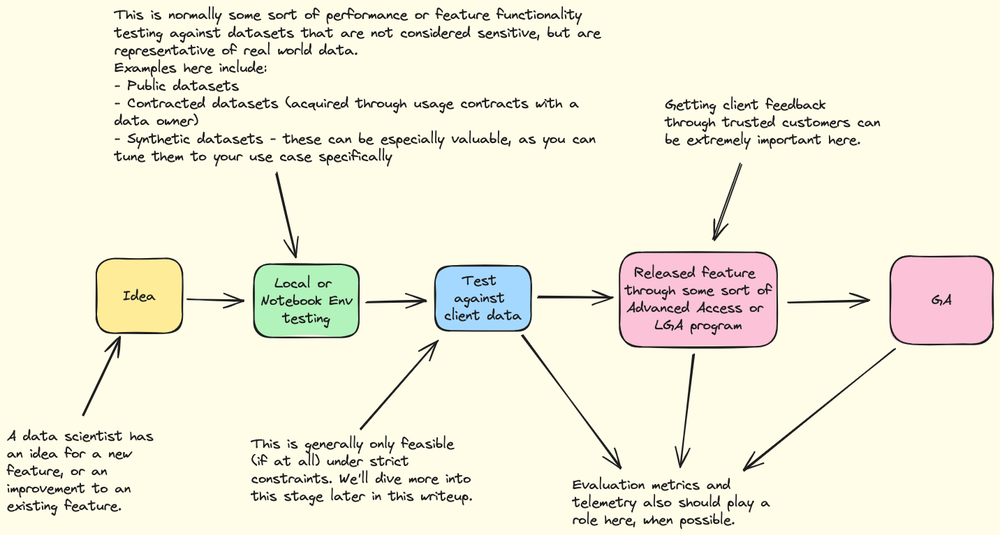

# How to do ML Ops when dealing with highly sensitive data

## Setting the stage

Imagine you have a SaaS product or service you provide that is powered by AI/ML, but interacts with highly sensitive data. Examples domains here can be medicine, political analysis, and litigation.
The features you serve through your app use AI/ML to deliver value, and as such, the normal questions of research, iteration, and evaluation that normally have existing paradigms become infinitely harder to implement in reality due to risk. Every ML Ops Engineer, Data Engineer, or Data Scientist that has developed AI/ML features under these constraints dreads the ever so common veto from Legal/Compliance/Risk teams.

Navigating all of these issues, while also trying to do good research and engineering is hard.

I hope some insights from my experience navigating this problem set are of use to future readers.

## Research to Production lifecycle
The ML Ops lifecycle normally consists of everything involved in going from a data scientist's idea to a released AI/ML feature.

Now let's say you have some sort of classifier AI/ML workflow. 
